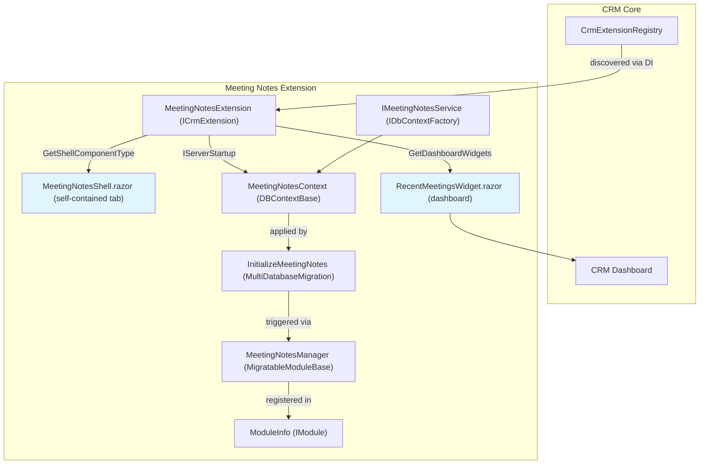
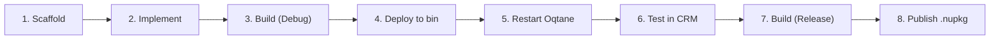

# Meeting Notes — CRM Extension Showcase

> **Download:** [StudioElf.Module.CRM.MeetingNotes on GitHub](https://github.com/StudioElf/StudioElf.Module.CRM/tree/master/Extensions/StudioElf.Module.CRM.MeetingNotes)

A production-quality reference extension for the **StudioElf CRM Extension Model**. Meeting Notes demonstrates every SDK pattern and serves as the canonical example for building CRM add-in modules.

---

## What It Does

Meeting Notes adds a self-contained tab to the CRM where users can record meeting summaries, attendees, and action items linked to CRM contacts. Each meeting is stored in the extension's own database table via Oqtane's multi-tenant `DBContextBase`.

| Feature | Detail |
|---------|--------|
| Shell tab | Full contact selector with search and sort |
| CRUD | Add, edit, delete meetings via inline modals |
| Dashboard widget | Recent meetings card on CRM dashboard |
| Email templates | Seed + send meeting summaries with placeholder tokens |
| Mentions | CRM MentionEditor — @mention autocomplete, preview toggle, mention notification emails with deep links |
| Deep links | Notification email opens the meeting in the edit dialog (`?ticket={id}`) |
| Audit | `ModelBase` audit fields (CreatedBy, ModifiedBy, etc.) |
| Migrations | `MultiDatabaseMigration` with entity builders |
| DI | `IDbContextFactory<T>` pattern for scoped DbContext |
| Install | `MigratableModuleBase` + `IInstallable` for zero-click migration |

---

## Architecture



---

## Key SDK Patterns Demonstrated

### 1. Extension Registration (ModuleInfo.cs)

```csharp
// IModule tells Oqtane "this DLL is an installable module"
// Categories = "Headless" prevents showing in the module picker
// CRM discovers extensions via DI, not the module picker
public class ModuleInfo : IModule
{
    public ModuleDefinition ModuleDefinition => new ModuleDefinition
    {
        Name = MeetingNotesModuleInfo.DisplayName,
        Categories = "Headless",
        Version = MeetingNotesModuleInfo.Version,
        ReleaseVersions = "1.0.0",
        ServerManagerType = "StudioElf.Module.CRM.MeetingNotes.Manager.MeetingNotesManager, ...",
        Dependencies = "StudioElf.Module.CRM.Shared.Oqtane",
        PackageName = "StudioElf.Module.CRM.MeetingNotes"
    };
}
```

### 2. ICrmExtension Implementation

```csharp
// Stateless metadata provider — no constructor params, no DI
// All values from MeetingNotesModuleInfo constants
public class MeetingNotesExtension : ICrmExtension
{
    public string ExtensionId => MeetingNotesModuleInfo.ExtensionId;
    public string DisplayName => MeetingNotesModuleInfo.DisplayName;
    public Type GetShellComponentType() => typeof(MeetingNotesShell);
    public List<CrmDashboardWidget> GetDashboardWidgets() => new()
    {
        new("recent-meetings", "Recent Meetings", typeof(RecentMeetingsWidget), 10)
    };
    public List<CrmEmailTemplate> GetEmailTemplates() => new()
    {
        new("Meeting Summary", "Meeting Summary: {{MeetingTitle}}", "...")
    };
    public List<CrmContactTab> GetContactTabs() => new();
    // Return empty lists, never null
    public List<TimelineItem> GetTimelineItems(...) => new();
}
```

### 3. Tenant-Aware DbContext

```csharp
// DBContextBase handles multi-tenant connection resolution
// ITransientService ensures DI registration
// IMultiDatabase supports SQL Server, SQLite, PostgreSQL, MySQL
public class MeetingNotesContext : DBContextBase, ITransientService, IMultiDatabase
{
    public MeetingNotesContext(IDBContextDependencies deps) : base(deps) { }
    public DbSet<MeetingNote> MeetingNotes => Set<MeetingNote>();
    // OnConfiguring handled by DBContextBase — no provider-specific code
}
```

### 4. Multi-Database Migration

```csharp
[DbContext(typeof(MeetingNotesContext))]
[Migration("StudioElf.Module.CRM.MeetingNotes.01.00.00.00")]
public class InitializeMeetingNotes : MultiDatabaseMigration
{
    public InitializeMeetingNotes(IDatabase database) : base(database) { }
    protected override void Up(MigrationBuilder migrationBuilder)
    {
        var builder = new MeetingNoteEntityBuilder(migrationBuilder, ActiveDatabase);
        builder.Create();
    }
}
```

### 5. Service with IDbContextFactory

```csharp
public class MeetingNotesService : IMeetingNotesService
{
    private readonly IDbContextFactory<MeetingNotesContext> _factory;

    public MeetingNotesService(IDbContextFactory<MeetingNotesContext> factory)
    {
        _factory = factory;  // transient factory — creates context per operation
    }

    public async Task<List<MeetingNoteDto>> GetAllAsync(int moduleId)
    {
        await using var db = await _factory.CreateDbContextAsync();
        return await db.MeetingNotes
            .Where(m => m.ModuleId == moduleId)
            .OrderByDescending(m => m.MeetingDate)
            .Select(m => ToDto(m))
            .ToListAsync();
    }
}
```

### 6. ServerStartup DI Registration

```csharp
public class ServerStartup : IServerStartup
{
    public void ConfigureServices(IServiceCollection services)
    {
        services.AddSingleton<ICrmExtension>(sp => new MeetingNotesExtension());
        services.AddDbContextFactory<MeetingNotesContext>(opt => { }, ServiceLifetime.Transient);
        services.AddScoped<IMeetingNotesService, MeetingNotesService>();
    }
    // Configure() and ConfigureMvc() left empty — migrations via IInstallable
}
```

### 7. Module Install via MigratableModuleBase

```csharp
public class MeetingNotesManager : MigratableModuleBase, IInstallable
{
    public bool Install(Tenant tenant, string version)
    {
        return Migrate(new MeetingNotesContext(_DBContextDependencies), tenant, MigrationType.Up);
    }
}
```

---

## Project Structure

```
Extensions/StudioElf.Module.CRM.MeetingNotes/
├── Client/
│   ├── MeetingNotesShell.razor            # Shell tab: contact selector, MentionEditor, deep links
│   └── RecentMeetingsWidget.razor         # Dashboard card
├── Extensions/
│   └── MeetingNotesExtension.cs            # ICrmExtension implementation
├── Manager/
│   └── MeetingNotesManager.cs              # MigratableModuleBase + IInstallable
├── Migrations/
│   ├── 01000000_Initialize.cs              # MultiDatabaseMigration
│   └── EntityBuilders/
│       └── MeetingNoteEntityBuilder.cs     # Entity builder pattern
├── Models/
│   ├── MeetingNotesModuleInfo.cs           # Static metadata constants
│   └── MeetingNotesContracts.cs            # Entity + DTOs
├── Repository/
│   └── MeetingNotesContext.cs              # DBContextBase DbContext
├── Services/
│   ├── IMeetingNotesService.cs            # Service interface
│   └── MeetingNotesService.cs             # Service implementation
├── Startup/
│   └── ServerStartup.cs                   # IServerStartup + DI
├── Package/
│   ├── debug.cmd                          # Debug build script
│   ├── release.cmd                        # Release + NuGet pack
│   ├── StudioElf.Module.CRM.MeetingNotes.nuspec
│   └── icon.png
├── ModuleInfo.cs                          # Oqtane IModule registration
├── StudioElf.Module.CRM.MeetingNotes.slnx # Solution with Oqtane.Server
└── StudioElf.Module.CRM.MeetingNotes.csproj
```

---

## Development Lifecycle



---

## How to Use

### As a reference

1. **Browse the code** on [GitHub](https://github.com/StudioElf/StudioElf.Module.CRM/tree/master/Extensions/StudioElf.Module.CRM.MeetingNotes)
2. **Read the spec** at `docs/spec-meetingnotes-extension.md` in the extension folder
3. **Follow the patterns** — every file is commented with SDK guidance

### As a starting point

1. Scaffold a new extension via **CRM Extension Manager** (CRM tab → Extensions)
2. Study the Meeting Notes source for patterns your extension needs
3. Copy and adapt the relevant patterns to your extension project

### Install and test

```bash
# Build in Release to generate the .nupkg
cd Extensions/StudioElf.Module.CRM.MeetingNotes
dotnet build -c Release

# Or use the Package scripts directly
cd Package
release.cmd net10.0
```

The `.nupkg` is copied to `oqtane.framework/Oqtane.Server/Packages/`. Install via Oqtane Admin → Modules.

---

## Database Table

The extension creates one table: `StudioElfCRMExtnMeetingNote`

| Column | Type | Purpose |
|--------|------|---------|
| Id | int (PK) | Auto-increment |
| ModuleId | int | Tenant module |
| ContactId | int | FK to CRM contact |
| CompanyId | int? | Optional FK to company |
| DealId | int? | Optional FK to deal |
| Title | nvarchar(500) | Meeting title |
| Summary | nvarchar(max) | Markdown + @mention tokens |
| MeetingDate | datetime2 | When occurred |
| DurationMinutes | int | Meeting length |
| Location | nvarchar(500) | Physical/virtual |
| ActionItems | nvarchar(max) | JSON array |
| Attendees | nvarchar(2000) | Attended names |
| CreatedBy | nvarchar(256) | User who created |
| CreatedOn | datetime2 | Creation timestamp |
| ModifiedBy | nvarchar(256) | Last editor |
| ModifiedOn | datetime2 | Last edit timestamp |

---

## Email Templates

Seeded on extension install:

| Template | Subject | Body Tokens |
|----------|---------|-------------|
| Meeting Summary | `Meeting Summary: {{MeetingTitle}}` | `{{MeetingTitle}}`, `{{MeetingDate}}`, `{{AttendeeCount}}`, `{{Summary}}`, `{{ActionItems}}` |

Click **Send Summary** on any meeting to email the summary to the linked contact.

> **Self-heal:** the shell calls `CrmService.SeedDefaultTemplatesAsync(ModuleId, ["MeetingNotes"])` before sending. The CRM only seeds extension templates when the extension is (re)installed, so a module instance that predates the extension would otherwise have no template — and `SendTemplateAsync` silently returns when the template is missing.

---

## Mention Notifications & Deep Links

The summary field is hosted by the CRM **MentionEditor** (`StudioElf.Module.CRM.Components`) — @mention autocomplete scoped by `ModuleId`, `#` entity mentions, markdown preview toggle. Accepted mentions store as structured tokens — `@[Sarah Smith](user:12)` — so they survive user renames.

```razor
<MentionEditor @ref="_summaryEditor"
               Content="@_edit.Summary"
               ContentChanged="@((c) => _edit.Summary = c)"
               ModuleId="ModuleState.ModuleId"
               EntityName="Meeting Note"
               EntityId="@_editingId"
               Height="140px"
               ShowPreview="true"
               PreviewRenderer="RenderPreviewAsync" />
```

**Save flow — persist first, notify second.** After the meeting is written, the shell tells the editor it is saved; the CRM emails every mentioned user (Oqtane Notification) with a deep link:

```csharp
var meetingId = _editingId;                                   // or created.Id from CreateAsync
var mentionUrl = $"Index?tab=ext:{MeetingNotesModuleInfo.ExtensionId}&ticket={meetingId}";
await _summaryEditor.NotifyMentionsAsync(userName, mentionUrl);
```

The dialog closes and the list reloads **before** the notification call — a notification failure surfaces as a banner and never traps the user in the modal. If Monaco interop is unavailable, the shell falls back to `CrmService.ProcessMentionNotificationsAsync` with the form content directly.

**Deep links.** The CRM prepends its known base to the suffix, so the email link lands on `.../Index?tab=ext:MeetingNotes&ticket=5`. `tab=ext:MeetingNotes` selects the extension tab; the shell's `ApplyDeepLinkAsync` reads `ticket` from `NavigationManager.Uri` (`PageState.QueryString` fallback during SSR) and opens that meeting in the edit dialog. `OnParametersSet` re-applies the link when the query changes while the shell stays alive, and a URI-dedup guard keeps the dialog from re-opening after a save reload.

**Rendering.** The list view and the editor preview render the summary through `CrmBase.RenderMarkdown` — mention tokens become styled, clickable spans (same pipeline as CRM pages).

---

## What This Extension Teaches

| Pattern | Where |
|---------|-------|
| `ICrmExtension` registration | `Extensions/MeetingNotesExtension.cs` |
| `IModule` (Headless) + `ReleaseVersions` | `ModuleInfo.cs` |
| `DBContextBase` + `IMultiDatabase` | `Repository/MeetingNotesContext.cs` |
| `MultiDatabaseMigration` + entity builders | `Migrations/` |
| `IDbContextFactory<T>` injection | `Services/MeetingNotesService.cs` |
| `MigratableModuleBase` + install hook | `Manager/MeetingNotesManager.cs` |
| `IServerStartup` + DI + migration | `Startup/ServerStartup.cs` |
| `ModelBase` audit fields | `Models/MeetingNotesContracts.cs` |
| Dashboard widgets | `Client/RecentMeetingsWidget.razor` |
| Email template integration | `Extensions/MeetingNotesExtension.cs` (GetEmailTemplates) |
| MentionEditor + mention notifications | `Client/MeetingNotesShell.razor` (NotifyMentionsAsync after save) |
| Deep-link query handling | `Client/MeetingNotesShell.razor` (ApplyDeepLinkAsync, OnParametersSet re-apply) |
| Markdown/mention rendering | `CrmBase.RenderMarkdown` in list + preview |
| Static metadata constants | `Models/MeetingNotesModuleInfo.cs` |
| Multi-language Blazor handlers | `Client/MeetingNotesShell.razor` (@onclick, @bind) |
| Post-build packaging | `.csproj` PostBuildPackage target |
| Commented reference code | Every `.cs` and `.razor` file |

---

## Version

**0.1.0** — RC2, aligned with StudioElf CRM Extension Model.

---

[↑ Back to SDK Documentation](../README.md)
